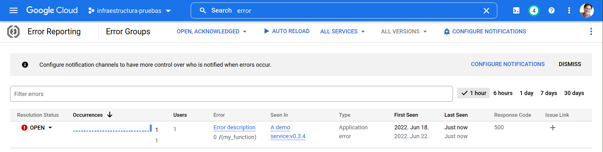

<!-- README.md is generated from README.Rmd. Please edit that file -->

```{r, include = FALSE}
knitr::opts_chunk$set(
  collapse = TRUE,
  comment = "#>",
  fig.path = "man/figures/",
  out.width = "100%"
)
library(jsonlite)
library(lubridate)
```


<!-- badges: start -->
[](https://cran.r-project.org/package=googleErrorReportingR)
<!-- badges: end -->

# googleErrorReportingR
This is an R wrapper for the Google Cloud Platform Error Reporting API. It uses
the Error Reporting API as defined in the [projects.events.report](https://cloud.google.com/error-reporting/reference/rest/v1beta1/projects.events/report)
method.


## Installation

You can install the development version of googleErrorReportingR from
[GitHub](https://github.com/) with:

``` r
# install.packages("devtools")
devtools::install_github("ixpantia/googleErrorReportingR")
```

## Usage
Before you start, please set up a file called `.Renviron` that contains the
following line.

```
PROJECT_ID=<your gcp project id>
ERROR_REPORTING_API_KEY=<your api key>
```

If you are running a session, then restart your R session so that the
environmental variables are read.

You can pass on the `project_id` and `api_key` to the function call directely,
but since we typically use this many time in one code-base we default to the
values in the environmental variables so that instead of:

```{r, eval= FALSE}
report_error(project_id, api_key, message)
```

We can call

```{r, eval= FALSE}
report_error(message)
```

and put the effort in defining the error message at each location in the code
that we want to monitor.

the following is a basic example of usage:

```{r example}
library(googleErrorReportingR)

message <- format_error_message()

message$serviceContext$service <- "A demo service"
message$serviceContext$version <- "v0.3.4"

googleErrorReportingR::report_error(message)
```

If your projet-id and api_key are set up correctly the message above will
appear in the Google Error Reporting UI as follows:



## Adding details
Note that the message we are sending, once we convert the list to the json body
as required by the API, contains all the information elements that we can add to
the message.

```{r}
toJSON(message, auto_unbox = TRUE, pretty = TRUE )
```

Please read the vignette for further details on how to configure each and
everyone of them.

## Roadmap
We are working on the next version of `googleErrorReportingR` to include the use
of the `list` endpoint.
